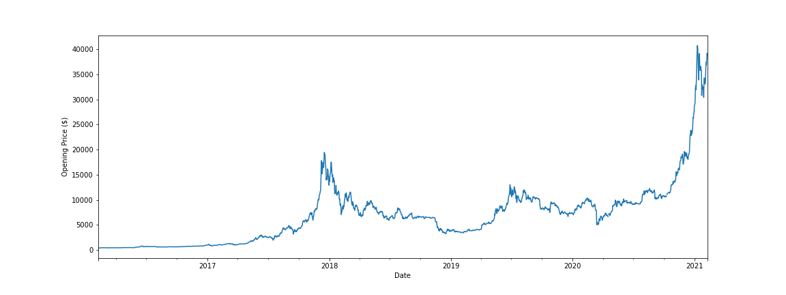

# Project-3
## Bitcoin Price Prediction

Our group aims is to predict Bitcoin prices in the marketplace using historical data, we use Python and Machine Learning programes . Our data sources is from Yahoo finance -Historical price.

We started by cleaning, also we use the rolling mean function to make our data set less variation and iterate through the entire data  and we  preprocessing the data - scale both X_train and y_train the 
     
     
     
In this project machine-learning algorithms will be used for predicting changes in Bitcoin prices in the short run, from historical time series data of quantitative factors that affect Bitcoin prices. The concept is to implement a system capable of analysing real time data and give a sense of direction to investors to help in decision making. The application will take in real world data and will go through a series of data reshaping which will get the data ready to be fed into the machine learning algorithms. Using this data, the model will be able to predict the Bitcoin price of tomorrow.

Libraries we are planning to use:
Python Matplotlib
HTML/CSS
SciKitLearn
Karas
Javascript D3

