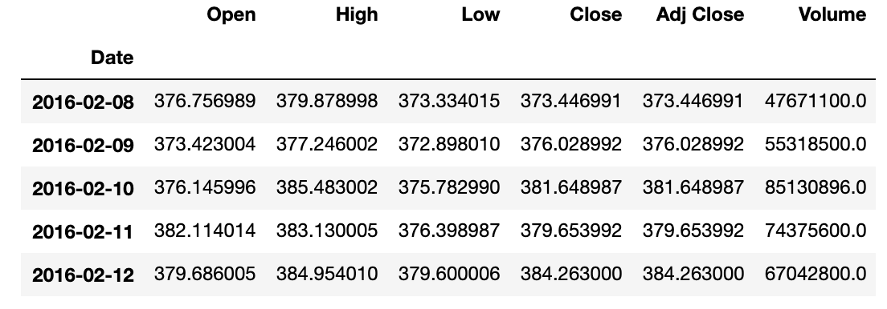
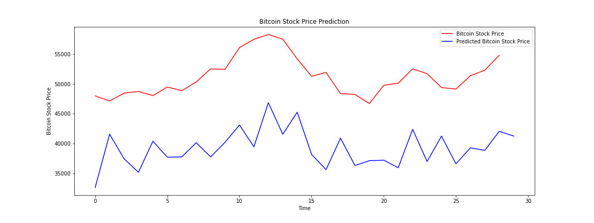

# Project-3
## Bitcoin Price Prediction

Our group aims is to predict Bitcoin Stock Prices in the marketplace using historical data, we use Python and Machine Learning programs . Our data sources is from Yahoo finance -Historical price.

We started by cleaning our data, also use the rolling mean function to make our data set less variation because of the up and down with the stock pirce and iterate mean through the entire data set  and the data been normalized using a minimum-maximum scaler. that is translating the whole set of price values to the range 0-1, by assigning ) to the lowest original value,1 to the highest, and a linear equivalent to the rest of the  values, lying in between the extremes. Once the scaler has been fitted to the data, it can be used after producing the model to invert the transformation on th predicted values, to recover the original ranges of values for the predictions. The reason to Normalize the data is to help the RNN and specifically back-propgation and gradient descent learn faster by reducing the magnitude of the value search space.  we build our RNN and compile with epos =100, batch_size= 64

Libraries we are  used:

Python - Matplotlib, pandas, Numpy, datime 
HTML/CSS
SciKitLearn- sklearn
Karas - Sequential, Dense, LSTM, Dropout

In Conclusions and future work
even if we didn't see any close prediction  but interms of the Trend we have some good indication on the direction of the stock heading either upward or downward, but this is a very short project and we will build up on more improvments in to the code - model furture for the prediction interms of dollar value. 

https://amelchristy.github.io/Project-3/templates/Prediction.html
